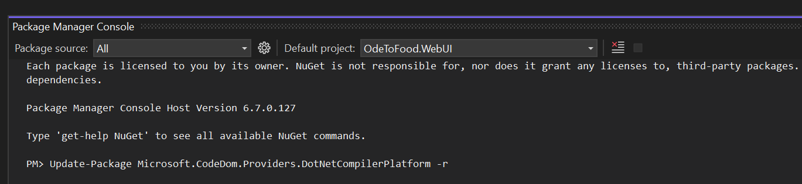
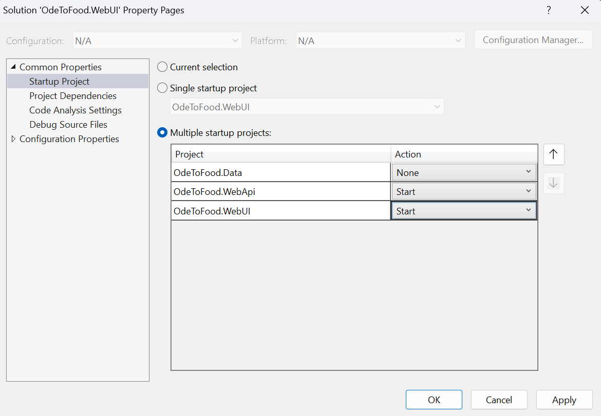
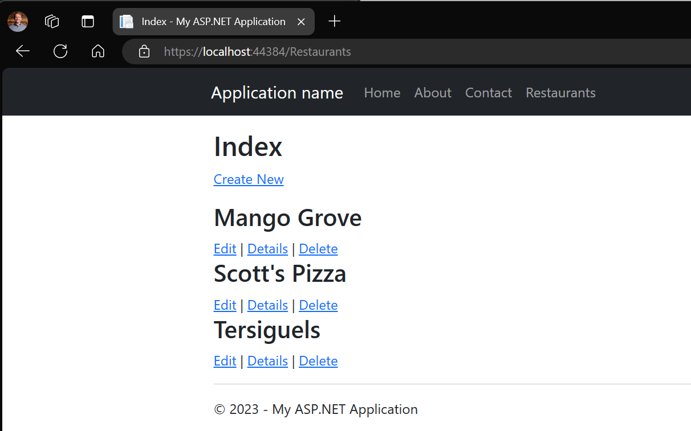
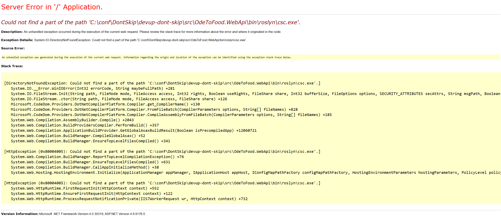
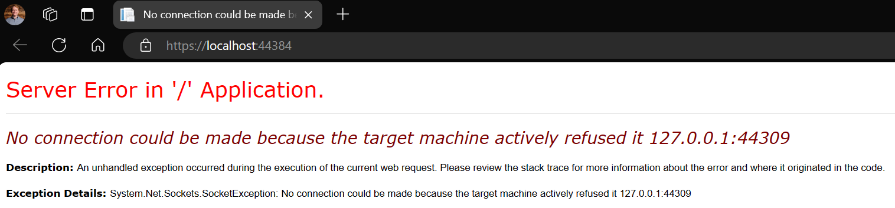

# Don't skip the hard parts - migrating old .net apps
Migration is hard, going at it alone is harder. My team at Microsoft has spent years working with customers - we heard one message loud and clear: please don't skip the hard parts when you offer migration guidance.

## Getting Started
Run the app and observe the CRUD operations for ODE to Food an MVC web app with a Web API backend that uses an in-memory dataset.

1. Restore the DotNetCompilerPlatform package.

    Use the Package Manager Console to run the following command for both ASP.NET web projects.
    ```sh
    Update-Package Microsoft.CodeDom.Providers.DotNetCompilerPlatform -r
    ```

    

1. Set multiple startup projects

    

    https://learn.microsoft.com/en-us/visualstudio/ide/how-to-set-multiple-startup-projects?view=vs-2022

1. Start the solution and view the Restaurants page

    

    You are now ready to use the Pull Requests to learn about how to apply Configuration Builders for External Configuration and [Polly](https://github.com/App-vNext/Polly) to build reliable service communication.

    > **Note**<br>
    >  For ASP.NET Core web apps we recommend learning about the new Microsoft Extensions packages. Watch Brady Gaster introduce them at BUILD 2023 in his talk [Cloud-native development with .NET 8 | BRK201H](https://youtu.be/qoNflu8aRaA?t=1421).

## Additional resources

- [Reliable web app pattern - Azure Architecture Center | Microsoft Learn](https://learn.microsoft.com/azure/architecture/web-apps/guides/reliable-web-app/overview)
    - [Introducing the Reliable Web App Pattern for .NET - .NET Blog (microsoft.com)](https://devblogs.microsoft.com/dotnet/introducing-the-reliable-web-app-pattern/)
    - [The Reliable Web App Pattern for .NET - YouTube](https://www.youtube.com/playlist?list=PLI7iePan8aH54gIDJquV61dE3ENyaDi3Q)
- [Retry pattern - Azure Architecture Center | Microsoft Learn](https://learn.microsoft.com/azure/architecture/patterns/retry)
- [Make HTTP requests using IHttpClientFactory in ASP.NET Core | Microsoft Learn](https://learn.microsoft.com/aspnet/core/fundamentals/http-requests?view=aspnetcore-7.0#use-polly-based-handlers)
- [HttpClient guidelines for .NET - .NET | Microsoft Learn](https://learn.microsoft.com/dotnet/fundamentals/networking/http/httpclient-guidelines#recommended-use)
- [Use the IHttpClientFactory - .NET | Microsoft Learn](https://learn.microsoft.com/dotnet/core/extensions/httpclient-factory?source=recommendations)
- [Configuration builders for ASP.NET | Microsoft Learn](https://learn.microsoft.com/en-us/aspnet/config-builder)
- [Cloud-native development with .NET 8 | BRK201H](https://youtu.be/qoNflu8aRaA?t=1421)
    - [NuGet Gallery | Microsoft.Extensions.Http.Resilience](https://www.nuget.org/packages/Microsoft.Extensions.Http.Resilience)
- [Migrate an ASP.NET web application to Azure with Visual Studio - Training | Microsoft Learn](https://learn.microsoft.com/en-us/training/paths/migrate-aspnet-web-application/)
- [Cache ASP.NET Session State Provider | Microsoft Learn](https://learn.microsoft.com/en-us/azure/azure-cache-for-redis/cache-aspnet-session-state-provider)

## Troubleshooting
Tips for dealing with issues.

**Server Error: Could not find a part of the path**


- Use the Package Manager Console to run the following command for both ASP.NET web projects.

```sh
Update-Package Microsoft.CodeDom.Providers.DotNetCompilerPlatform -r
```

**Server Error: No connection could be made**


- Configure the solution to set both web apps as startup projects.