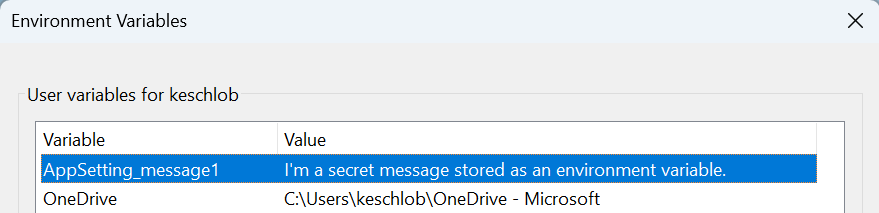

# Configuration Demo script

This demo capture changes shown in the Pull Request https://github.com/KSchlobohm/devup-dont-skip/pull/1/files

@TODO - Add screenshots for bindingRedirect fixes that Visual Studio handles

## Pre-requisite

1. Configuration builders require ASP.NET version 4.7.1 or later.
1. Create an environment variable to be used with the External Configuration code sample.



|Name|Value|
|--|--|
|AppSetting_message1|Loading external configurations is like asking a penguin to pick your outfit – you might end up with a tuxedo at the beach!|


## Step 1: Load Configuration from Environment vars
How can we load configuration from different sources without changing code?

**Demo**

1. Run the web app and observe

- There's a greeting in the index.cshtml that comes from web.config

1. Add a package reference to the *OdeToFood.WebUI* project.

    > Install-Package Microsoft.Configuration.ConfigurationBuilders.Environment -ProjectName OdeToFood.WebUI -Version 3.0.0

1. View **Warnings** and use VisualStudio to fix bindingRedirects as recommended

    ...insert image...

1. Modify the `web.config` of OdeToFood.WebUI to use Configuration Builders

    1. Add configSections

    ```xml
          <configSections>
            <section name="configBuilders" type="System.Configuration.ConfigurationBuildersSection,
			         System.Configuration, Version=4.0.0.0, Culture=neutral,
			         PublicKeyToken=b03f5f7f11d50a3a" restartOnExternalChanges="false" requirePermission="false" />
          </configSections>
          <configBuilders>
            <builders>
              <add name="AS_Environment" mode="Strict" prefix="AppSetting_" stripPrefix="true" type="Microsoft.Configuration.ConfigurationBuilders.EnvironmentConfigBuilder,
		           Microsoft.Configuration.ConfigurationBuilders.Environment" />
            </builders>
          </configBuilders>
    ```

    1. Modify the app settings to include new values
    
    > **Note**<br>
    > Observe the new attribute used on the appSettings block which correlates to config builder sources.
    
    > **Note**<br>
    > One of the *gotchas* of this approach is that the alue must exist (even if blank) in the web.config file before it can be overriden with a config builder.

    ```xml
      <appSettings configBuilders="AS_ENVIRONMENT">
        <add key="message1" value="Giving external configurations to your code is like letting a pancake flip itself – one moment it's brunch, the next it's trying to dance on the griddle!" />
        <add key="message2" value="Getting external configurations into your system is like giving a cat a GPS – you never know if it'll lead to a gourmet restaurant or a cardboard box alley!"/>

        <add key="webpages:Version" value="3.0.0.0" />
        <add key="webpages:Enabled" value="false" />
        <add key="ClientValidationEnabled" value="true" />
        <add key="UnobtrusiveJavaScriptEnabled" value="true" />
      </appSettings>
    ```

1. Run the web app and observe

- We didn't change C# code but we changed the behavior and can see a new message on the home page.

## Step 2: Override Environment Configuration with a config file
Let's explore layered configuration by viewing 2 configuration sources and 2 different messages.

- What happens if we only put a configuration into one of the two sources?
- What happens if we define a configuration value in two sources?

**Demo**

1. Add a package reference to the *OdeToFood.WebUI* project.

    > Install-Package Microsoft.Configuration.ConfigurationBuilders.Json -ProjectName OdeToFood.WebUI -Version 3.0.0

1. View **Warnings** and use VisualStudio to fix bindingRedirects as recommended

    ...insert image...

1. Create a new file named config.json

    ```json
    {
        "appSettings": {
            "message1": "Imagine explaining external configurations to a coffee machine – suddenly, your app's brewing up espressos of efficiency and lattes of laughter!",
            "message2": "Imagine if your app's external configurations were ingredients at a salad bar – suddenly, your code thinks it's a mixologist offering code-cumber cocktails and data-dressing delights"
        }
    }
    ```

1. Configure the file as copy to output directory

1. Modify the `web.config` of OdeToFood.WebUI to use Configuration Builders

    1. Add the new Config Builder definition
    
    ```xml
            <builders>
              <add name="AS_Environment" mode="Strict" prefix="AppSetting_" stripPrefix="true" type="Microsoft.Configuration.ConfigurationBuilders.EnvironmentConfigBuilder,
		           Microsoft.Configuration.ConfigurationBuilders.Environment" />
	          <add name="AS_Json" mode="Strict" jsonFile="~\config.json" jsonMode="Sectional" type="Microsoft.Configuration.ConfigurationBuilders.SimpleJsonConfigBuilder,
		           Microsoft.Configuration.ConfigurationBuilders.Json" />
            </builders>
    ```

    1. Override the attribute in AppSettings and define the new *greeting* configuration
    
    ```xml
      <appSettings configBuilders="AS_Json, AS_Environment">
        <add key="message1" value="Giving external configurations to your code is like letting a pancake flip itself – one moment it's brunch, the next it's trying to dance on the griddle!" />
        <add key="message2" value="Getting external configurations into your system is like giving a cat a GPS – you never know if it'll lead to a gourmet restaurant or a cardboard box alley!"/>
	
        <add key="webpages:Version" value="3.0.0.0" />
        <add key="webpages:Enabled" value="false" />
        <add key="ClientValidationEnabled" value="true" />
        <add key="UnobtrusiveJavaScriptEnabled" value="true" />
      </appSettings>
    ```

1. Run the web app and observe

- The value for the greeting is overriden from config.json as expected
- We can see an order of operations, a priority, of configuration where Environment vars were overriden by config.json data.